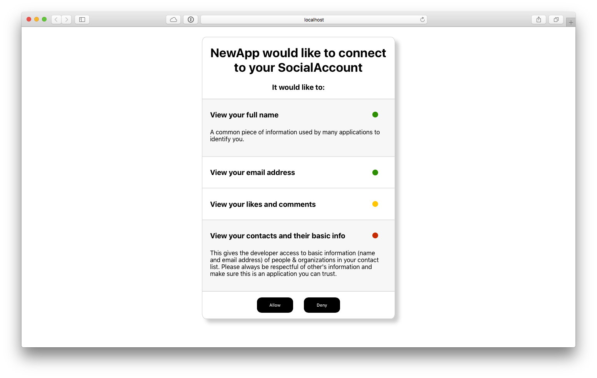

# User Nudging Playground

## (Long) Intro

A personal privacy project of mine. I want to explore ways "user nudging" can be employed in common UX elements we see in apps & sites today. This project and the concept of user nudging was introduced to me by [this paper on privacy self-management](http://bit.ly/2lJHkcp) via [Lindsey Barrett on Twitter](http://bit.ly/2lTcpKD).

Data privacy self-management is something that has been espoused by many in the tech industry - by providing transparency and control, users will make the best decisions for themselves. And for the most part I agree with this.

That said, as evidenced by things like the Cambridge Analytica/Facebook scandal, users don't always understand the impact of sharing certain data categories. This can stem from many things, including a sense of "trust" in the platform. It could be argued that trust led to the spotlight on Facebook in the CA scandal.

User nudging is premised on the concept that technology companies have a better understanding of the sensitivity & impact of sharing certain data categories than their typical user. But, instead of locking down the user's data and removing choice, technology companies (particularly platforms) should use their knowledge to proactively inform and "nudge" users in the write direction.

## First Prototype

Currently a work in progress, my first prototype is of the classic "This 3rd Party App Wants To Access Your" page we see commonly with platforms.

### Nudges

- Color coding data categories provide an immediate visual ranking to the user of the data transaction that is being proposed

- Combined with the color coding, expandable items provide more generalized context as to that data category's ranking

- (Still Being Worked On) Data lifespan information will inform users how long the app's ToS say their data will be held

- (Still Being Worked On) Data control information will inform users if they will be able to manage the shared data from their current platform or need the 3rd party app - additionally it will let users know the ability (via the ToS) for the 3rd party app to share the data

## Reach out

If any of this sparks interest, feel free to reach out to me here or [on Twitter](http://bit.ly/15Tv57Z)! Thanks for reading!

### Getting Started

 `npm install`
 `npm start`
